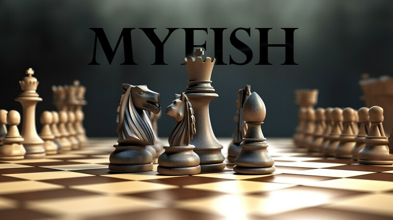

# myfish


UCI chess engine written in C++

The concepts to make this engine were learned from [bbc](https://github.com/maksimKorzh/chess_programming/tree/master/src/bbc), and i tried to apply concepts from [Stockfish](https://github.com/official-stockfish/Stockfish) (not many).

## Compile from source
in order to compile from source
```
make ARCH=bmi2 NATIVE=1 profile-build
```
It suppors Windows and Linux.
